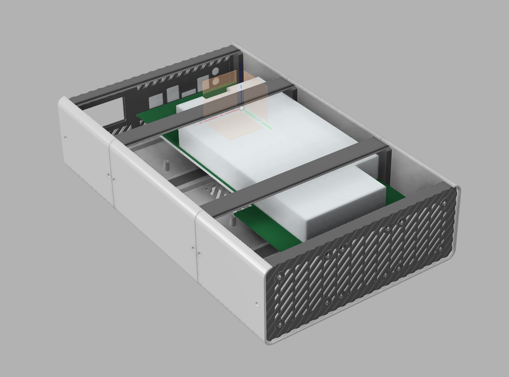
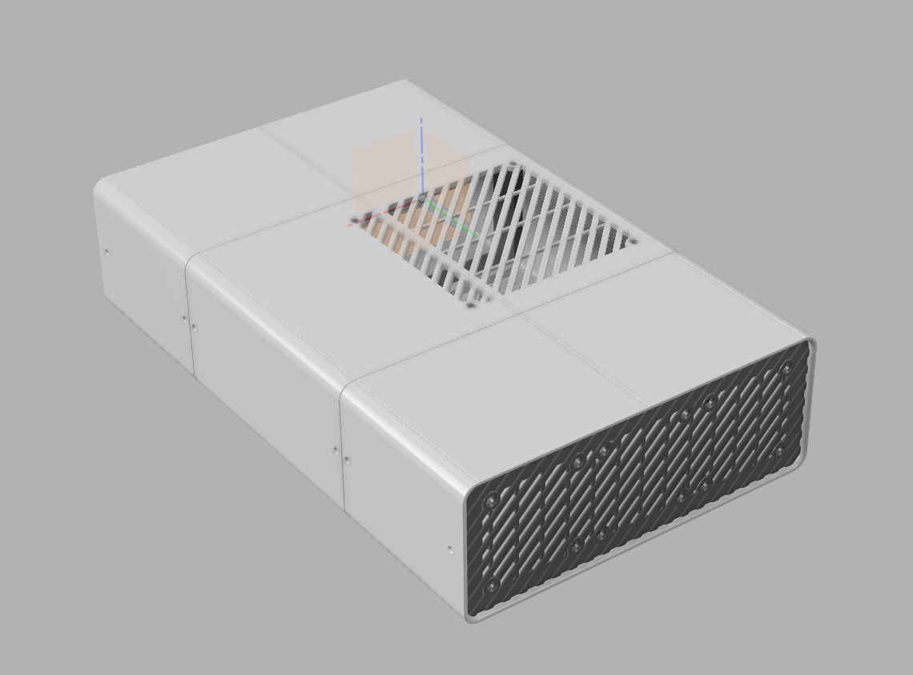
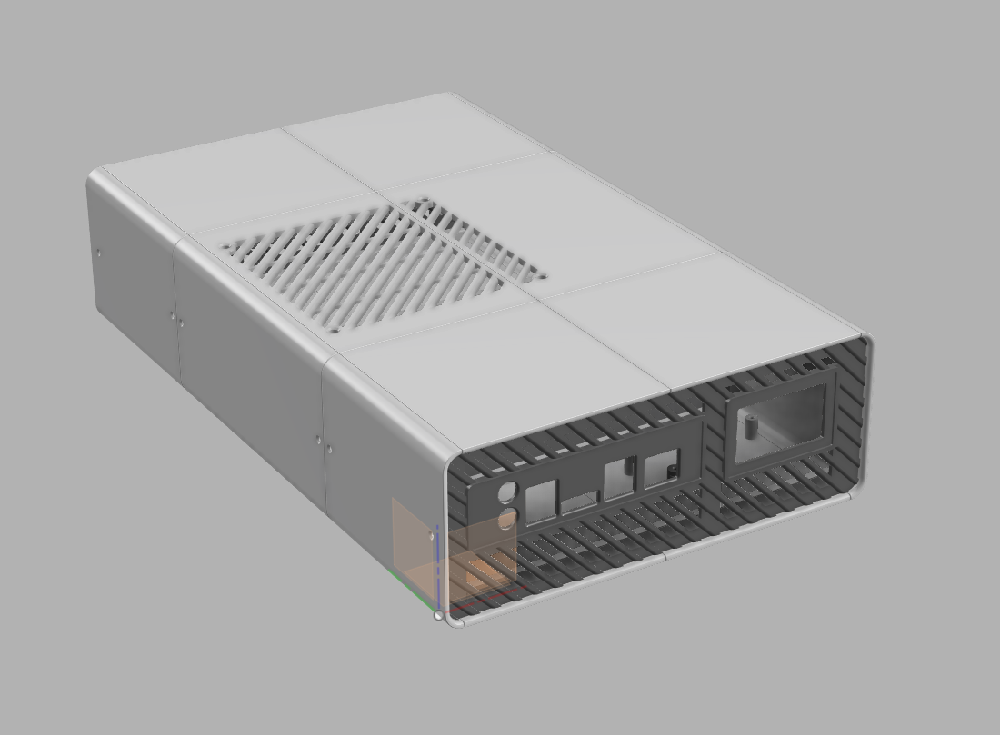

# Модульный корпус для BC-250

Проект разработан для личного использования и сообщества

## 🖨️ Печать

Печатал PLA и PETG на Bambu Lab A1 Mini

## 🔧 Совместимость

- Плата: BC250
- БП: Dell L240ES-00
- Вентиляторы: 60 мм и 120 мм (толщина 15 мм)
- Вплавные гайки M2 OD 3.5мм длина 4мм + винты M2 длина 6мм
- Розетка с выключателем и предохранителем с али

## 📜 License

This project is licensed under: 
Creative Commons Attribution-NonCommercial-ShareAlike 4.0 
https://creativecommons.org/licenses/by-nc-sa/4.0/ 
(CC BY-NC-SA 4.0)
